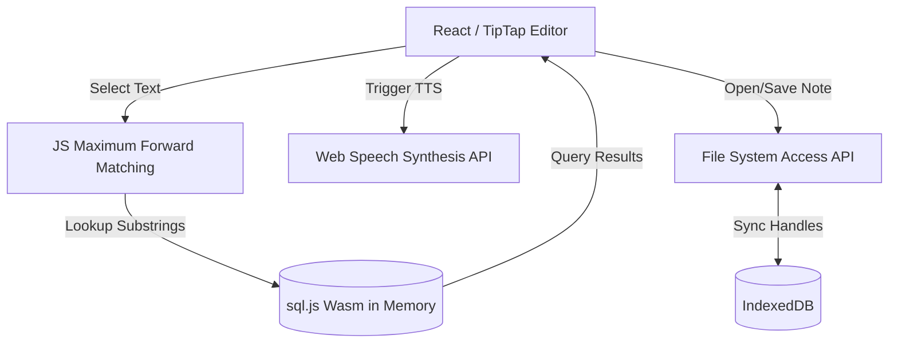

# Hanzi First — Web-Based Chinese Study Notebook 📚

Hanzi First is a client-side, web-based Markdown editor designed for Chinese language learners. It provides instant pronunciation feedback as you type, automated text-to-speech reading on selections, and a contextual Chinese-English dictionary popup powered by WebAssembly.

The entire application runs **100% client-side** in your browser. No databases, servers, or external trackers are queried for lookups or dictations, ensuring complete privacy and fast offline operations.

---

## ✨ Core Features

*   **🎙️ Interactive IME Validation (Speak-on-Type):**
    As you type Chinese characters using your keyboard input method (IME) and press Space or Enter, the application instantly speaks the typed word. This helps learners immediately catch homophone errors.
*   **📖 Intelligent Selection Reading:**
    Double-click or drag-select any paragraph or sentence. The editor automatically reads the selection aloud after 400 milliseconds using native Web Speech Synthesis. Clicking anywhere in the editor cancels playback instantly.
*   **🔍 Floating Wasm-Powered Dictionary:**
    Selected text automatically displays a floating lookup bar showing definitions. Click on individual segmented words inside the popup to show their traditional counterparts, pinyin with tone marks, and English definitions from the CC-CEDICT database.
*   **📝 Multi-tab Markdown Editor:**
    Write notes in rich markdown formatting powered by **TipTap**. Supports multiple side-by-side split panels (Tmux columns) to easily compare texts or take vocabulary notes.
*   **📂 Direct File System Integration (Web API):**
    Open files, save modifications directly to your local drive, or load entire directories of text notes using the browser's modern **File System Access API**. 
*   **💾 Persistent Workspaces:**
    Saves your open tabs, focused pane settings, and file handles in **IndexedDB** so your workspace is restored exactly as you left it after browser reloads.
*   **🚀 Dockerized Deployment:**
    Preconfigured with a multi-stage Docker build and **Caddy** static file server, optimized for automatic HTTPS and fast asset compression.

---

## 🛠️ Architecture & Under the Hood



*   **Frontend:** React 19, TypeScript, Vite, Tailwind CSS v4, Lucide Icons.
*   **Rich Text Engine:** TipTap Editor with markdown extension wrappers.
*   **Database Engine:** `sql.js` (SQLite compiled to WebAssembly) loading a vacuumed, pre-compiled CC-CEDICT database (`cedict.db`, ~17.3MB) directly into browser memory.
*   **Segmenter:** Client-side Maximum Forward Matching (MFM) parser matching lookups directly against SQLite keys.
*   **File Sync:** IndexedDB helper layer to persist local file handle access tokens across browser restarts.

---

## 🚀 How to Run Locally

### Prerequisites
Make sure you have Node.js (version 20 or higher) and npm installed.

### 1. Install Dependencies
```bash
npm install
```

### 2. Launch Development Server
```bash
npm run dev
```
Open your browser and navigate to **`http://localhost:5173`**.

### 3. Rebuilding the static assets
```bash
npm run build
```
This builds the production package into the `dist/` directory, copying the optimized `/public/cedict.db` file.

---

## 🐳 Docker & VPS Deployment

Hanzi First runs completely client-side in the user's browser, meaning it only requires a static web server to be served.

### 1. Build and Run Container
We use a multi-stage `Dockerfile` which compiles the static files and serves them using **Caddy** (configured with compression, headers, and SPA routing fallbacks):
```bash
docker compose up -d --build
```
The app will immediately compile and run at **`http://localhost:8080`**.

### 2. Deploying with Domain & HTTPS
Because the File System Access API strictly requires a secure context to function (HTTPS), you should run it with SSL on your VPS.

1.  Open [docker-compose.yml](file:///home/aurel/PERSO/chinese_notebook/docker-compose.yml) and update ports to standard HTTP/S:
    ```yaml
    ports:
      - "80:80"
      - "443:443"
    ```
2.  Open [Caddyfile](file:///home/aurel/PERSO/chinese_notebook/Caddyfile) and change `:80` to your actual domain name:
    ```caddy
    yourdomain.com {
        root * /srv
        encode gzip zstd
        try_files {path} /index.html
        file_server
        # (cache headers...)
    }
    ```
3.  Restart composition. Caddy will automatically request and bind a Let's Encrypt SSL certificate for your domain.

---

## 🗄️ Updating the Dictionary Database

The dictionary database `cedict.db` is built using the CC-CEDICT parser script under `scripts/`. If you want to update it to include the latest entries:

1.  Make sure you have `python3` installed on your machine.
2.  Run the update script:
    ```bash
    python3 scripts/build-db.py
    ```
This will automatically:
*   Download the latest CC-CEDICT zip archive from MDBG.
*   Extract and parse the UTF-8 dictionary lines.
*   Convert numerical pinyin (e.g. `ni3 hao3`) into accent marks (`nǐ hǎo`).
*   Load all entries into a new SQLite database at `public/cedict.db`.
*   Optimize lookups by building indices on `simplified` and `traditional` columns.
*   Run `VACUUM;` to minimize the file size.
